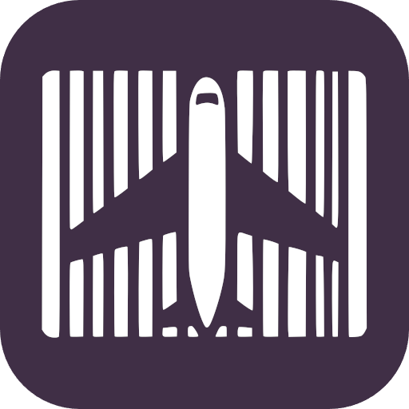

<picture></picture>

# Boarding Pass Scanner

An Android app for scanning boarding passes to view the information encoded in them.

Some features of the app:
* Scan boarding passes, whether they are mobile boarding passes or printed ones.
* Get information about the flight, such as the airline, flight number, departure and arrival airports, departure and arrival times, and boarding time.
* See if the boarding pass is TSA PreCheck approved.

## Development

Built with:
* 100% Kotlin except included library code.
* UI in ~99% [Jetpack Compose](https://developer.android.com/jetpack/compose)
* [Kotlin Flow](https://kotlinlang.org/docs/flow.html)
* [Android ViewModels](https://developer.android.com/topic/libraries/architecture/viewmodel)
* Barcode scanning with [ML Kit](https://developers.google.com/ml-kit/vision/barcode-scanning)
Framing screenshots with [framer](https://github.com/amandeepg/framer)

## Screenshots
 
